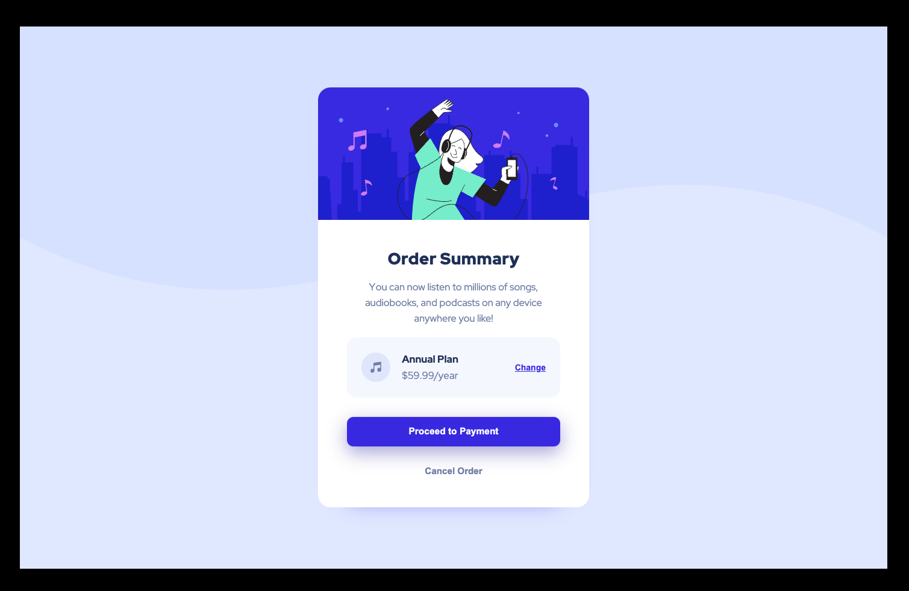

# Frontend Mentor - Order summary card solution

This is a solution to the [Order summary card challenge on Frontend Mentor](https://www.frontendmentor.io/challenges/order-summary-component-QlPmajDUj). Frontend Mentor challenges help you improve your coding skills by building realistic projects. 

## Table of contents

- [Overview](#overview)
  - [Screenshot](#screenshot)
  - [Links](#links)
- [My process](#my-process)
  - [Built with](#built-with)
- [Author](#author)

### Screenshot

### Links

<!-- - Solution URL: (https://github.com/Neonnati/NFT-preview-card-component-solution-Frontend-Mentor)
- Live Site URL: (https://neonnati.github.io/NFT-preview-card-component-solution-Frontend-Mentor/) -->

### Built with

- Semantic HTML5 markup
- CSS custom properties
- Flexbox

## Author

- Website - [Neonnati](https://github.com/Neonnati)
- Frontend Mentor - [@Neonnati](https://www.frontendmentor.io/profile/Neonnati)